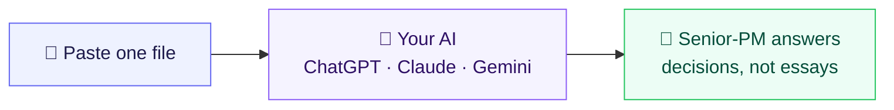

# 🎯 product-skill

### Turn ChatGPT, Claude, or Gemini into a senior product mentor — with one copy-paste.

**One free file. No install, no account, no subscription.** Paste it into the AI you already use, and generic answers become the kind of advice a seasoned product leader would give: a clear recommendation, the right framework for the moment, and a gut-check on your blind spots.

---

## What you get

**You ask:** *"We have 5 features requested for next quarter but only room for 2. How do I decide?"*

| 🤖 Plain AI | 🎯 AI + product-skill |
|---|---|
| "It depends on impact and effort. You could try a prioritization framework like RICE or MoSCoW. Gather stakeholder input, weigh each feature against your goals, and align with the roadmap. Consider both short-term wins and long-term value, and make sure to balance quick wins against strategic bets…" | **Use RICE here** — you have rough reach and effort for each, so it gives a defensible ranking fast. Scoring your five: |
| | **Ship A and C this quarter.** A is high-reach, low-effort — the obvious win. C is the strategic enabler the rest depends on. |
| *Lists options. Hands the work back to you. No recommendation, no opinion.* | **Defer B** (high effort, unproven reach) and **park D + E.** |
| | ⚠️ **Blind-spot check:** RICE rewards *this quarter's* reach. If B is your enterprise bet, RICE will quietly under-rank it every time. Don't silently drop it — flag it to leadership as a strategic call, separate from the score. |

> [!NOTE]
> Same AI. Same question. The difference is product-skill turning a hedge-everything answer into **a decision you can defend** — plus a check on where that decision could bite you.

*(The A–E features above are a template to show the format — not a real case study.)*

---

## Start in 3 steps

<b>ChatGPT</b>

1. Open `SKILL.md` and **copy everything** (or download the file).
2. Start a **new chat** and paste it as your first message — or attach the file.
3. Ask your product question normally. Done.

💡 *Reuse it:* save it as the instructions for a **Custom GPT** or a **Project** so you never re-paste.

<b>Claude</b>

1. **Copy** the contents of `SKILL.md`.
2. Paste it into a **new chat** — or add it to a **Project's** custom instructions, or load it as a **Skill**.
3. Ask your product question.

💡 *Reuse it:* drop it into a **Project** as a knowledge file and it's always on.

<b>Gemini</b>

1. **Copy** the contents of `SKILL.md`.
2. Paste it as your **first message** in a new chat — or save it as a **Gem**.
3. Ask away.

---

## What it helps you do

| When you're trying to… | …it helps you |
|---|---|
| Decide what to build next | Pick the right way to prioritize and actually score your options |
| Write a PRD or one-pager | Draft a decision-ready doc — not a wall of text |
| Sharpen your positioning | Nail who it's for and why it wins |
| Set or defend pricing | Pressure-test your model and what people will really pay |
| Choose success metrics | Pick metrics that won't quietly game themselves |
| Ship an AI feature | Build a plan to prove it actually works before launch |
| Pitch leadership | Tighten the story and pre-empt the hard questions |
| Sanity-check a big call | Run a blind-spot check before you commit |

---

## Try these first

> [!TIP]
> **Prioritize** — "I have 5 features and room for 2 next quarter. Help me decide."

> [!TIP]
> **Draft** — "Turn these messy notes into a one-page PRD: `<paste notes>`"

> [!TIP]
> **Pressure-test** — "Poke holes in this positioning statement: `<paste>`"

> [!TIP]
> **Metrics** — "What metric should we use for `<feature>` — and how could it backfire?"

---

## Why this, vs. the alternatives

|  | **product-skill** | Plain AI chat | PM prompt packs | Paid PM tools |
|---|:---:|:---:|:---:|:---:|
| Cost | Free | Free | Free | Subscription |
| Works inside the AI you already use | ✅ | ✅ | ✅ | Sometimes |
| One file, nothing to set up | ✅ | n/a | Varies | ❌ |
| Gives a recommendation, not a lecture | ✅ | Rarely | Varies | ✅ |
| Built-in blind-spot check | ✅ | ❌ | ❌ | Varies |
| Open — read it, edit it, make it yours | ✅ | ❌ | Often | ❌ |

---

## FAQ

**Is it free?** Yes. No account, no subscription. Open source (CC BY-SA 4.0).

**Do I need to install anything?** No. It's one file you paste into a chat.

**Does it send my data anywhere?** No. It's just text instructions for the AI you're already using — your conversation stays wherever you're working.

**Which AI is best for it?** It's built to behave the same across ChatGPT, Claude, and Gemini. Use whichever you already have.

**Do I need to be technical?** No. If you can copy and paste, you can use it.

**Will it replace a PM?** No. It's a thinking partner that drafts and pressure-tests — you still make the call.

---

## ⚙️ For builders & contributors

*Product folks can stop above — everything below is about how it's built and how to extend it.*

### How it works

product-skill is deliberately **one lean file**. It opens by telling your AI to do four things on every product question: ask only the clarifying questions that genuinely matter, pick the *single* right framework instead of dumping a menu, lead with a recommendation, and run a blind-spot check sized to the stakes. A short routing section sends each kind of request (prioritization, pricing, metrics, discovery, and so on) to the matching part of the file. Keeping it to one portable file is a design choice: it loads fast, stays readable, and works identically on every platform — no bundle, no scripts, nothing to break when a tool updates.

### Go deeper — PRO modules

The base file handles the everyday job on its own. For a task that needs deep, worked treatment, type `Load PRO: <name>` and your AI hands you the exact block to paste — plain text, same on every platform, no install.

| `Load PRO:` | Use when you're… | Paste from |
|---|---|---|
| `pricing` | running a willingness-to-pay study, tiering, or AI/outcome pricing | `pro/pricing.md` |
| `ai-evals` | building a full eval plan, validating an AI judge, or monitoring quality | `pro/ai-evals.md` |
| `positioning` | doing an end-to-end positioning build, sales pitch, or launch plan | `pro/positioning.md` |
| `growth` | designing experiments, growth loops, or a PLG motion | `pro/growth.md` |
| `discovery` | writing interview guides or designing assumption tests | `pro/discovery.md` |
| `metrics` | building a North Star + input-metric tree or guardrails | `pro/metrics.md` |
| `strategy` | writing a strategy doc, business plan, or portfolio plan | `pro/strategy.md` |

If a module isn't loaded, the file tells your AI to hand you the path and offer a clearly-flagged lighter answer from the base file — never to fake the curated depth.

### Customize it

It's just a text file — edit it. Add your own frameworks, swap in your company's context and metrics, trim sections you don't use, or fork it for your team. Share-alike under CC BY-SA 4.0 means your version stays open too.

### Contributing

Issues and pull requests welcome. Keep the file lean and portable — every addition should carry judgment a model wouldn't volunteer on its own (a when-to-use boundary, a calibration number, an anti-pattern, an opinionated default), not re-explain canon the AI already knows. Use feature branches (`feat/<desc>` or `fix/<desc>`) and open a PR.

### Roadmap

Tracked in the repo's public Issues and milestones.

---

## License & credits

**License:** [CC BY-SA 4.0](https://creativecommons.org/licenses/by-sa/4.0/) — reuse and adapt with attribution; share alike.

Built by synthesizing named practitioners and published frameworks; every recommendation in the file is grounded in a source cited inline. It draws on the work of:

- **Strategy & operating model** — Marty Cagan / SVPG, Gibson Biddle, Chandra Janakiraman, Lafley & Martin, Melissa Perri, John Cutler
- **Discovery & product sense** — Teresa Torres, Shreyas Doshi, Clayton Christensen, Tony Ulwick
- **AI-native PM** — Hamel Husain & Shreya Shankar, Aman Khan, Marily Nika & Diego Granados, IDEO / Tim Brown
- **Positioning, GTM & pricing** — April Dunford, Geoffrey Moore, Matthew Dixon & Ted McKenna, Madhavan Ramanujam, Patrick Campbell, Van Westendorp
- **Growth, metrics & experimentation** — Dave McClure, Elena Verna, Lenny Rachitsky, Amplitude, Google (HEART), Nir Eyal, Eric Ries, Ronny Kohavi / Tang / Xu, Tal Raviv
- **AI era, org, career & NPD** — Oji & Ezinne Udezue, Ethan Evans, Andrew Ng, Norton, Klaus Aumayr, Robert Cooper, Skelton & Pais, Rich Mironov, Gary Klein, Noriaki Kano, Reinertsen / SAFe

If you build on it, keep the attribution and pass the openness forward. 🎯
